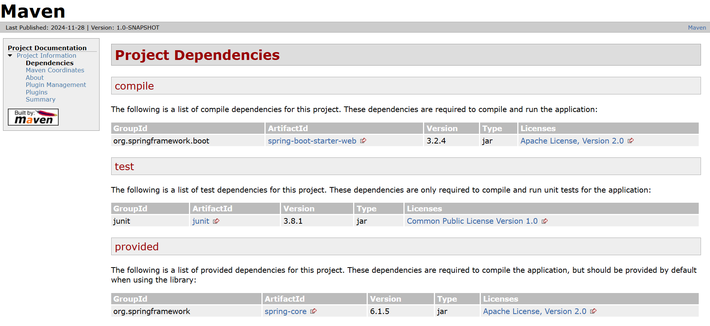

# Maven Lifecycle

The Maven Lifecycle is a well-defined sequence of build phases that handle the building, testing, packaging, and deployment of a project. It ensures that every necessary step in the build process is executed in the correct order, streamlining project development and deployment.

## Maven Lifecycles Overview

Maven defines three primary lifecycles:

1. **Clean**: Cleans up the project’s output directory.
2. **Default (Build)**: Handles project building, including compilation, testing, and packaging.
3. **Site**: Generates project documentation and reports.

Each lifecycle consists of specific phases that are executed in order.

---

## Maven Lifecycles and Phases

### 1. **Clean Lifecycle**
The **Clean Lifecycle** ensures that the build environment starts fresh by removing previous build outputs, such as the `target` directory.

#### Phases in Clean Lifecycle:
1. **Pre-clean**: Executes processes needed before cleaning.
2. **Clean**: Removes the build output (e.g., deletes the `target` directory).
3. **Post-clean**: Executes processes needed after cleaning.

#### Commands and Examples:
- To execute the entire **Clean Lifecycle**:
  ```bash
  mvn clean
  ```
  Example:
  ```bash
  $ mvn clean
  [INFO] Deleting directory /path/to/project/target
  ```

---

### 2. **Default (Build) Lifecycle**
The **Default Lifecycle** is the primary lifecycle for building and deploying projects. It includes several phases:

#### Phases in Default Lifecycle:
1. **Validate**: Validates the project structure and configuration.
2. **Compile**: Compiles the source code.
3. **Test**: Runs unit tests.
4. **Package**: Packages the compiled code into a distributable format (e.g., `.jar`, `.war`).
5. **Verify**: Runs checks to ensure the package meets quality standards.
6. **Install**: Installs the package into the local Maven repository.
7. **Deploy**: Deploys the package to a remote repository.

#### Commands and Examples:
- To run the `compile` phase:
  ```bash
  mvn compile
  ```
  Example:
  ```bash
  $ mvn compile
  [INFO] Compiling 10 source files to /path/to/project/target/classes
  ```

- To execute multiple phases up to `install`:
  ```bash
  mvn install
  ```
  Example:
  ```bash
  $ mvn install
  [INFO] Cleaning project...
  [INFO] Validating project...
  [INFO] Compiling source files...
  [INFO] Running unit tests...
  [INFO] Packaging application...
  [INFO] Verifying package...
  [INFO] Installing package to local repository...
  ```

---

### 3. **Site Lifecycle**
The **Site Lifecycle** generates project documentation and reports, such as Javadoc, test reports, and other metadata.

#### Phases in Site Lifecycle:
1. **Pre-site**: Executes processes needed before generating the site.
2. **Site**: Generates project documentation.
3. **Post-site**: Executes processes needed after generating the site.
4. **Site-deploy**: Deploys the generated site to a server.

#### Commands and Examples:
- To run the `site` phase:
  ```bash
  mvn site
  ```
  Example:
  ```bash
  $ mvn site
  [INFO] Generating project site...
  [INFO] Site generated at /path/to/project/target/site
  ```
- 

- To deploy the site:
  ```bash
  mvn site-deploy
  ```
  Example:
  ```bash
  $ mvn site-deploy
  [INFO] Deploying site to https://example.com/docs
  ```

### Deploy Phase Rules

The **Deploy Phase** uploads the packaged project to a remote repository, making it accessible to other developers or systems.

#### Rules for Deployment:
1. **Configure Remote Repository**: Ensure the `<distributionManagement>` section is properly configured in the `pom.xml` file, specifying the repository URL and credentials.
2. **Authentication**: Set up credentials in the `settings.xml` file located in the `.m2` directory.
   ```xml
   <servers>
       <server>
           <id>my-repo</id>
           <username>my-username</username>
           <password>my-password</password>
       </server>
   </servers>
   ```
3. **Valid Package**: Ensure the project has successfully passed all previous lifecycle phases (`validate`, `compile`, `test`, `package`, and `verify`).
4. **Correct Version**: Use the correct version of the project. Avoid deploying snapshot versions to release repositories.
5. **Use Secure Protocols**: Always use secure protocols like `https` for deploying to remote repositories.

#### Commands and Examples:
- To deploy a package:
  ```bash
  mvn deploy
  ```
  Example:
  ```bash
  $ mvn deploy
  [INFO] Deploying my-app.jar to https://repository.example.com/releases
  ```

---

## Conclusion
Understanding the Maven lifecycle and its phases is crucial for efficient project management. Each phase is designed to automate a specific part of the build process, ensuring consistent results and reducing manual effort.
